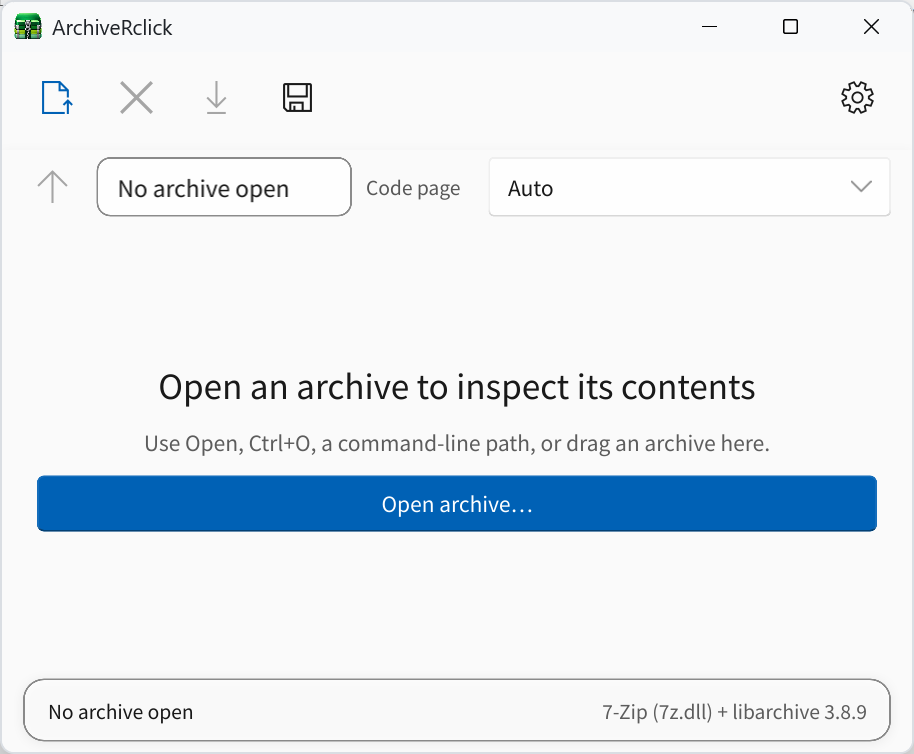

# ArchiveRclick

<p align="center">
  
</p>

ArchiveRclick is a Windows-focused archive browser written in Rust. It uses
Slint for the native desktop UI, libarchive for most archive formats, and the
7-Zip runtime (`7z.dll`) for 7z archives.

The project is intentionally small: open an archive, inspect it, extract all or
selected entries, test it, or create a new archive.

 
 
## Requirements

- Rust 1.92 or newer with the MSVC Windows target.
- A 64-bit Windows 10/11 system. The supported libarchive 3.8.9 runtime and its
  codec dependencies are bundled under `runtime/x64` and copied beside the
  executable automatically by `cargo build`.

Use a libarchive build that includes zlib, liblzma, and zstd if ZIP, TAR.GZ,
TAR.XZ, and TAR.ZST creation are required. The application detects read formats
from archive contents rather than filename extensions.

## Build

```powershell
cargo build --release
```

The resulting `target\release` directory contains `archive-rclick.exe`, the
eight required native runtime DLLs, and `THIRD-PARTY-NOTICES.md`. Keep these
files together when copying or packaging the application. Developers may set
`ARCHIVERCLICK_LIBARCHIVE` to an absolute path to test another supported
libarchive 3.x build.

Open an archive from the UI or pass it on the command line:

```powershell
target\release\archive-rclick.exe example.7z
```

Register ArchiveRclick as an available handler in Windows Default Apps (per
user, without overriding the user's existing choices):

```powershell
target\release\archive-rclick.exe --register
```

Use `--unregister` to remove that registration.

Explorer files and folders can be dropped onto the window. A single dropped
file is opened as an archive; multiple files or a folder are staged for archive
creation. In the archive list, Shift-click selects a contiguous range. Dragging
the selected entries to Explorer extracts them to the dropped location.

## Architecture

- `src/archive`: UI-independent archive API, metadata, options, and libarchive FFI.
- `src/tasks`: standard-thread cancellation and throttled progress primitives.
- `src/app`: Slint-facing state and command wiring.
- `src/platform`: Windows dialogs, dynamic-library lookup, and shell integration.
- `ui`: Slint components.

Archive entry paths are treated as untrusted. Extraction rejects absolute paths,
parent traversal, reserved Windows names, links, special files, and reparse-point
ancestors beneath the selected destination.

Listing and integrity testing apply entry, metadata, and decompressed-byte caps
to resist resource-exhaustion archives. Extraction also verifies opened root,
parent, and temporary-file handles remain under the selected destination before
installing output. The final Windows rename uses `MoveFileExW`; an attacker who
already has concurrent write access to the chosen destination can still create
a very narrow reparse-point swap race between the last check and that rename.
Fully removing that race requires NT handle-relative create/rename operations.

Runtime round-trip tests exercise the same bundled libarchive 3.8.9 DLL that is
copied into Cargo's target profile directory. `runtime/SHA256SUMS` records the
exact native payload; `scripts/package-release.ps1` creates a clean portable
release folder and verifies every bundled hash.